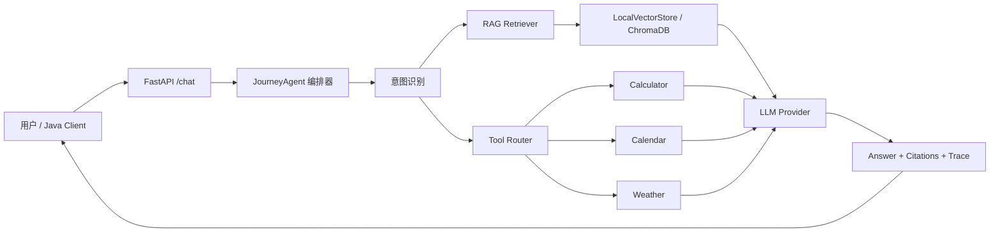

# 系统架构

## 分层说明

- API 层：负责协议、参数校验、响应格式。
- Agent 层：负责任务拆解、意图识别、工具选择、RAG 组合。
- RAG 层：负责知识库加载、向量化表示、相似度召回。
- Tool 层：封装可执行能力，避免 LLM 直接操作业务状态。
- LLM 层：默认 mock，生产可替换为 OpenAI-compatible 或 LangChain ChatModel。

