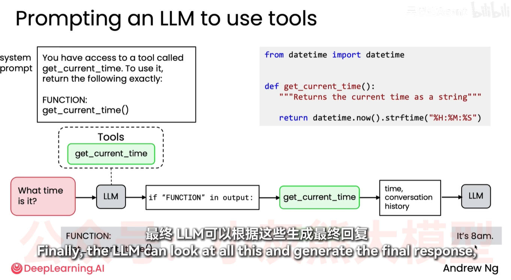
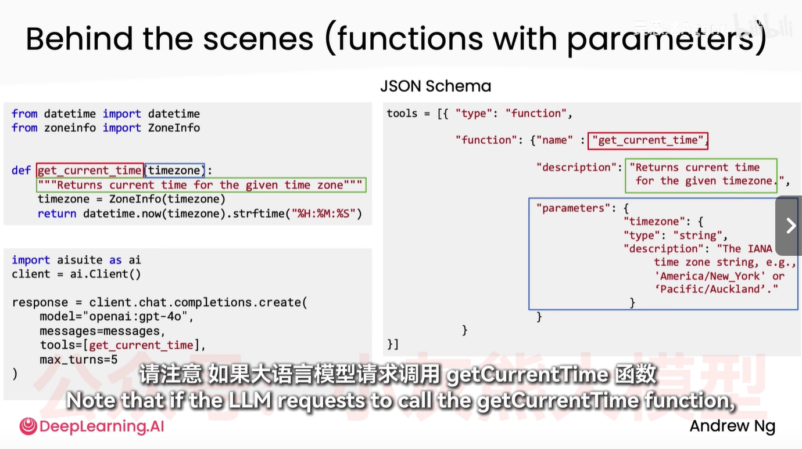
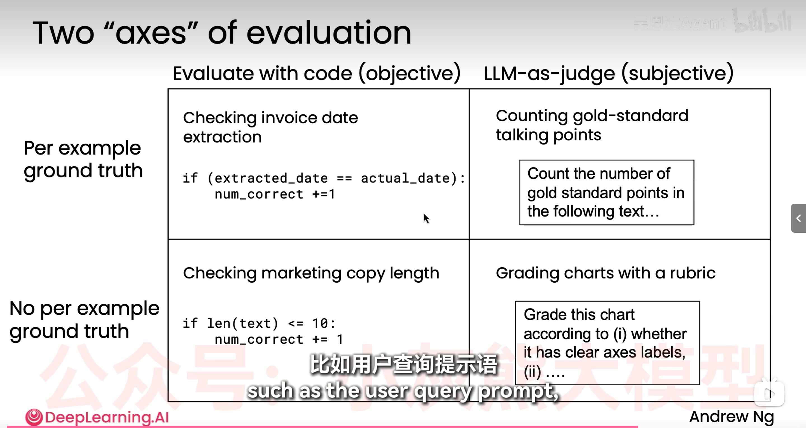
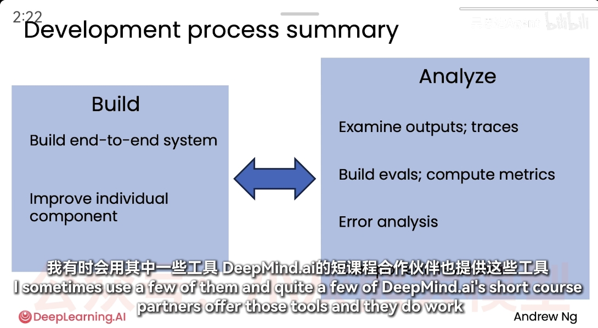

# 📚 Agent 学习日志

  <h2 style="margin-top: 0;">📈 学习概览</h2>
  
记录 Agent 技术学习的关键进展和收获，为未来面试和工作积累专业知识。

## 🗓️ 2026-03-03

  <h3 style="color: #333; margin-top: 0;">✅ 今日完成</h3>
  <ul style="list-style-type: '✓ '; padding-left: 20px;">
    <li>完成了 Git/GitHub 基础操作，成功推送第一个仓库。</li>
    <li>学习了吴恩达的模块1的课程（1-5），了解了agent的历史、形成、概念、自主性、优势及应用。</li>
  </ul>
  <h4 style="color: #666; margin-top: 15px;">📅 明日计划</h4>
  <ul style="list-style-type: '📋 '; padding-left: 20px;">
    <li>完成模块1的整个学习（6-8）</li>
    <li>开始模块2的学习</li>
  </ul>

## 🗓️ 2026-03-04

  <h3 style="color: #333; margin-top: 0;">✅ 今日完成</h3>
  <ul style="list-style-type: '✓ '; padding-left: 20px;">
    <li>学习了workflow，任务拆解，类似于人类的思维分解任务，但agent可同步多线程任务，设计好在每个步骤ai如何调用与组合合适的工具。（LLMs、API、other ai tools、information retrieval、code execution）。</li>
    <li>了解到良好的评估(evals)系统的重要性。当答复不满意时，手动告知ai调整，不断改进ai的性能。</li>
    <ul style="list-style-type: '🔍 '; padding-left: 20px; margin-top: 5px;">
      <li>重要的是检查中间进展，错误分析，能更好的提高agent性能。</li>
    </ul>
    <li>学习了几个关键的设计模式：</li>
    <ol style="padding-left: 30px; margin-top: 5px;">
      <li>看到错误→反馈agent→修复改进</li>
      <li>引入另一个agent，批判性角色，实现自动化监督</li>
      <li>多agent共线处理工作</li>
    </ol>
    <li>模块2开始（反射设计模式）</li>
    <li>通过反射提高任务输出质量</li>
    <li>理解了为什么倾向于使用反射式流程而非只给llm一次提示让其直接生成答案并结束？（后者也叫零样本提示）</li>
    <ul style="list-style-type: '💡 '; padding-left: 20px; margin-top: 5px;">
      <li>多阅读他人的提示语提示词来提高与ai的交流方式</li>
      <li>原因是为了更高的性能、更好的输出、更精准的答复。</li>
    </ul>
  </ul>
  <h4 style="color: #666; margin-top: 15px;">📅 明日计划</h4>
  <ul style="list-style-type: '📋 '; padding-left: 20px;">
    <li>学习如何用算法对生成的图片或图表进行反射</li>
    <li>完成模块2的整个学习（1-5）</li>
  </ul>

## 🗓️ 2026-03-05

  <h3 style="color: #333; margin-top: 0;">✅ 今日完成</h3>
  <ul style="list-style-type: '✓ '; padding-left: 20px;">
    <li>（2-4）反射，构建评测机构很重要！！！</li>
    <ul style="list-style-type: '🔍 '; padding-left: 20px; margin-top: 5px;">
      <li>ai存在的问题：1。回答欠佳2。位置偏差</li>
      <li>设计评测标准，设计多个评定标准，如涉及打分系统来评判</li>
      <li>基于评测标准来不断调整promt，使得更优秀</li>
    </ul>
    <li>（2-5）如何从外部获取更多的信息来提高反射流程</li>
    <ul style="list-style-type: '🔍 '; padding-left: 20px; margin-top: 5px;">
      <li>引入外部反馈&gt;反射&gt;不反射</li>
    </ul>
    <li>（模块3，工具使用）</li>
    <ul style="list-style-type: '🔍 '; padding-left: 20px; margin-top: 5px;">
      <li>让大模型调用初设函数。</li>
      <li>【自主选择】思考真正要实现哪些功能，然后创建这些函数以满足llm的使用</li>
    </ul>
    <li>（3-2）创建工具：梳理llm调用工具的流程与思路</li>
    <ul style="list-style-type: '🔍 '; padding-left: 20px; margin-top: 5px;">
      <li>此处插入图一： </li>
      <li>文字解释（形象化）：老师对学生说，如果你想去吃饭，请举手告诉我-&gt;学生举手-&gt;老师回复指令（允许或拒绝）-&gt;学生根据指令执行下一步操作（去或不去）。</li>
      <li>提供工具并告知llm可使用，llm针对提问生成一个特定输出，告知用户需要为llm调用函数，用户调用后获取输出并把用户刚调用的函数结果反馈给llm，llm再根据结果执行后续操作。（这是一个简单原始的例子）</li>
    </ul>
    <li>（3-3）工具语法</li>
    <ul style="list-style-type: '🔍 '; padding-left: 20px; margin-top: 5px;">
      <li>AISuite开源库（可以方便的调用多个大语言模型服务商）</li>
      <li>插入图二： </li>
    </ul>
    <li>完成模块3的整个学习（1-5）和开头模块4的内容</li>
  </ul>

## 🗓️ 2026-03-06

  <h3 style="color: #333; margin-top: 0;">✅ 今日完成</h3>
  <ul style="list-style-type: '✓ '; padding-left: 20px;">
    <li>（3-4）代码执行</li>
    <ul style="list-style-type: '🔍 '; padding-left: 20px; margin-top: 5px;">
      <li>涉及让DLM自动·编写代码，但注意在沙盒环境（Docker\E2B）中测试。</li>
      <li>MCP，模型上下文协议。</li>
    </ul>
    <li>（3-5）MCP的具体介绍与应用</li>
    <ul style="list-style-type: '🔍 '; padding-left: 20px; margin-top: 5px;">
      <li>集成多个平台数据，工作量过大。MCP规定涉及一个统一的封装调用标准，减低了时间。</li>
    </ul>
    <li>（模块4）构建agent的实用技巧</li>
    <li>（4-1）评估</li>
    <ul style="list-style-type: '🔍 '; padding-left: 20px; margin-top: 5px;">
      <li>先着手快速搭建一个快速原型系统，观察其表现来获取修复改良方向，针对问题解决来提升效果，而非计划！</li>
      <li>黄金标准讨论要点，LMS评判器，【你构建的评估体系中通常需要反应你在应用中关注或担心出错的地方。】</li>
      <li>插入图三： </li>
      <li>端到端，正确择选精力投入的位置。</li>
      <li>不断地优化评估系统。</li>
    </ul>
    <li>（4-2。4-3）误差分析与确定后续步骤优先级</li>
    <ul style="list-style-type: '🔍 '; padding-left: 20px; margin-top: 5px;">
      <li>在快速搭建后，但是效果不佳，如何择选经历的投入来优化该流程？（优化重点的能力）</li>
      <li>》深入理解工作流程中的每一步，尤其经常性的检查模型的推理过程记录，即每一步之后的中间输出结果（这样可以判断哪个环节的表现不佳）。</li>
      <li>表格分析</li>
    </ul>
  </ul>

## 🗓️ 2026-03-09

  <h3 style="color: #333; margin-top: 0;">✅ 今日完成</h3>
  <ul style="list-style-type: '✓ '; padding-left: 20px;">
    <li>（4-4）组件级评估</li>
    <ul style="list-style-type: '🔍 '; padding-left: 20px; margin-top: 5px;">
      <li>调节一些细节性的参数，可以得到一定的提升效果。但注意最后一定要使用一次端到端的测试。</li>
      <li>在设计调整之前，一定要评估是否要为之。</li>
    </ul>
    <li>（4-5）如何解决你发现的问题</li>
    <ul style="list-style-type: '🔍 '; padding-left: 20px; margin-top: 5px;">
      <li>1.优化prompts（如增加例子），2.use a new mod（培养对不同模型性能的直觉）el ，3.任务拆解，反思步骤， 4.对模型进行微调</li>
      <li>培养直觉：规模更大的前沿模型更优。经常去测试不同的模型来总结。</li>
      <li>重点！花时间去学习、理解先进的prompt语，开源包。</li>
      <li>也可以查看执行轨迹来获得正式的理解；通过组件级或端到端的评估来判断不同模型在工作流的性能。</li>
      <li>插入图四： </li>
    </ul>
    <li>（4-6）延迟、成本优化</li>
    <ul style="list-style-type: '🔍 '; padding-left: 20px; margin-top: 5px;">
      <li>1.构建（编写代码实现程序）2.分析（用时较多，但重要，这关乎决策）3.两种方法反复</li>
      <li>构建定制评测集</li>
    </ul>
    <li>（4-7）总结</li>
    <ul style="list-style-type: '🔍 '; padding-left: 20px; margin-top: 5px;">
      <li>先专注于输出质量，后置成本和延迟优化</li>
      <li>对工作流进行基准测试或计时，以便找出优化最大机会所在</li>
    </ul>
    <li>（5-1）学习设计模式，助你构建高度自主的智能体</li>
  </ul>

  <h3 style="color: #333; margin-top: 0;">🎯 学习目标</h3>
  
系统性掌握 Agent 技术的核心概念、设计模式和应用方法，为未来的职业发展打下坚实基础。

